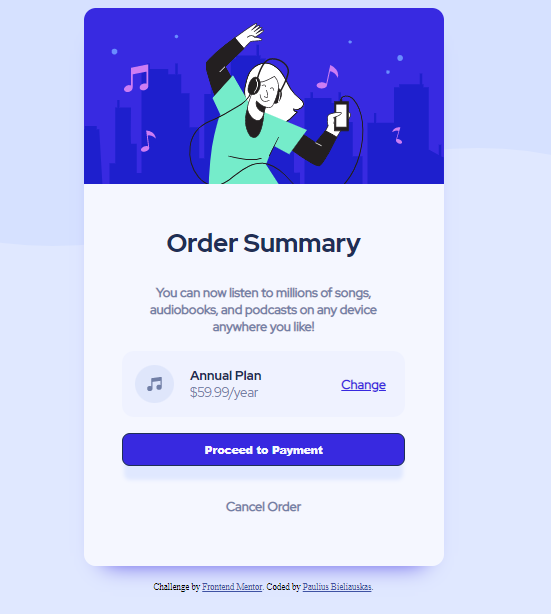

# Frontend Mentor - Order summary card solution

This is a solution to the [Order summary card challenge on Frontend Mentor](https://www.frontendmentor.io/challenges/order-summary-component-QlPmajDUj). Frontend Mentor challenges help you improve your coding skills by building realistic projects. 

## Table of contents

- [Overview](#overview)
  - [The challenge](#the-challenge)
  - [Screenshot](#screenshot)
  - [Links](#links)
- [My process](#my-process)
  - [Built with](#built-with)
  - [What I learned](#what-i-learned)
  - [Continued development](#continued-development)
  - [Useful resources](#useful-resources)
- [Author](#author)
- [Acknowledgments](#acknowledgments)

## Overview

### The challenge

Users should be able to:

- See hover states for interactive elements

### Screenshot

### Links

- Solution URL: [GitHub](https://github.com/Scarab911/01-Order-summary-component)
- Live Site URL: [Here](https://scarab911.github.io/01-Order-summary-component/)

## My process

### Built with

- HTML5 
- CSS
- Flexbox

### What I learned

Main thing I have learned working on this project was adding custom fonts to projects. Biggest obstacle was to make this project look smoothly on my old Iphone 7 Plus. Spent few hours working on @media's with different width's, playing in Google Chrome Dev Tools. Had a first practise with HSL color palete.

### Continued development

Biggest issue from this project at the moment is mobile responsivness, and fonts.

### Useful resources

- [Box shadow](https://getcssscan.com/css-box-shadow-examples) - This helped me with shadows :)
- [Flex](https://css-tricks.com/snippets/css/a-guide-to-flexbox/) - This is an amazing article which helped me make a layout with Flex box.

## Author

- GitHub - [@Scarab911](https://github.com/Scarab911)
- Frontend Mentor - [@Scarab911](https://www.frontendmentor.io/profile/Scarab911)
- LinkedIn - [@Paulius-Bieliauskas](www.linkedin.com/in/pauliusbieliauskas)

## Acknowledgments

Thanks to my frontend mentor [Rimantas Belovas](https://www.linkedin.com/in/rimantasbelovas/) for help with Fonts.

